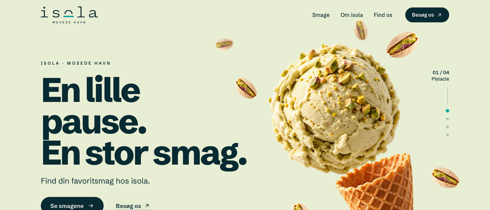
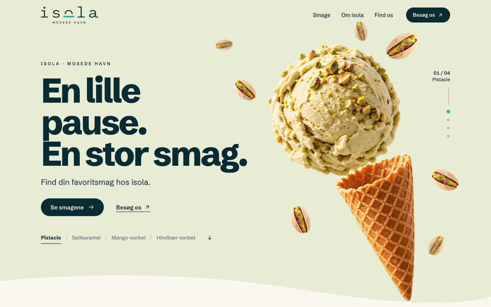
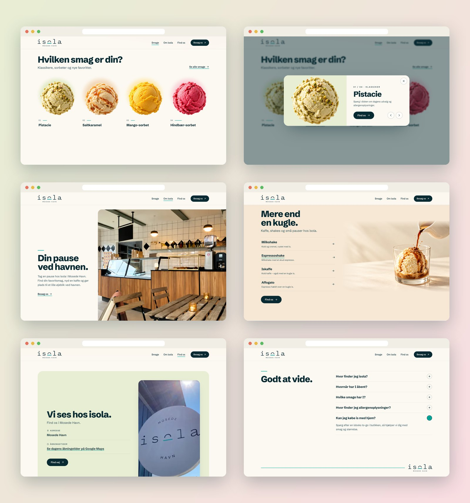
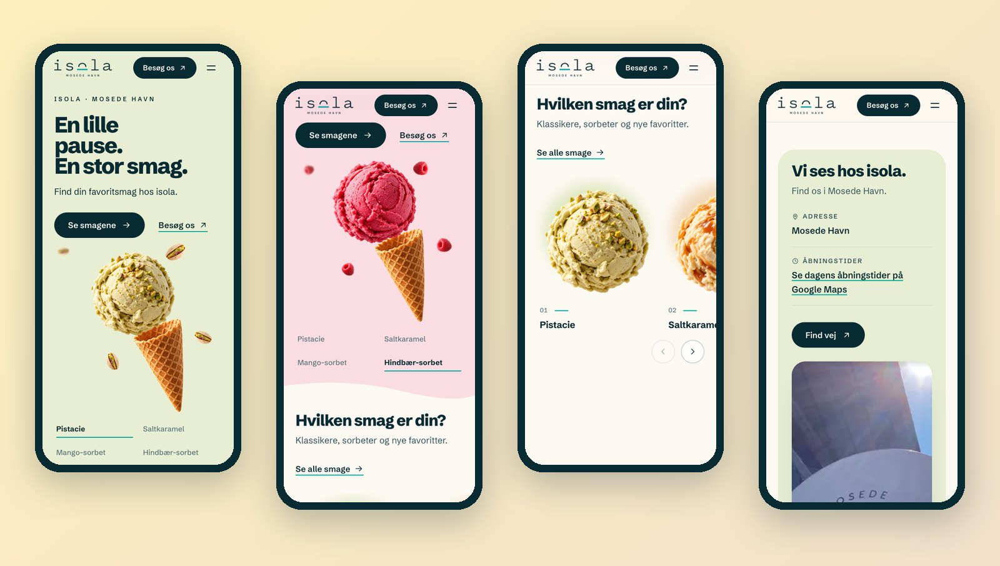

<div align="center">



<h3>A one-page website for an ice cream shop by the harbour in Mosede, built around a 2.5D hero with four flavour universes.</h3>

<p>
  <a href="#the-hero"><strong>🍨 How the hero works</strong></a>
  &nbsp;·&nbsp;
  <a href="#getting-started"><strong>🛠️ Run it locally</strong></a>
  &nbsp;·&nbsp;
  <a href="#content-checklist"><strong>📌 Before launch</strong></a>
</p>

<p>
  
  
  
  
  
</p>

</div>

<br />

## 🚀 Overview

**isola** is a local ice cream shop in Mosede Havn. The site has one job: make you want a scoop, then help you find the shop. It opens on a single, stable composition (headline on the left, a scoop suspended over a waffle cone on the right) and lets the flavour change around it. **Pistacie, Saltkaramel, Mango-sorbet and Hindbær-sorbet** each bring their own background, scoop and orbiting ingredients, by scroll or by a click on the selector.

At the end of the hero, the scoop drops into the cone and the whole group glides into its card in the flavour catalogue. From there the page walks to the shop, the drinks, the visit block and the FAQ.

- **One hero, four universes**: layout, title and buttons never move; only bowl, ingredients and colour change
- **Made from stills**: 14 transparent PNGs, no video and no 3D models. Movement stays in the screen plane (offset, scale, parallax, rotation), so textures stay sharp
- **Honest by default**: no invented descriptions, allergens, prices, address or opening hours. Everything still unconfirmed is marked `TODO(isola)`
- **For every visitor**: shorter flow on phones, static composition with `prefers-reduced-motion`, full keyboard support

<br />

<a name="the-hero"></a>

## 🍨 The hero

<div align="center">
  
  <sub>Selector clicks, then scroll: docking and hand-off to the catalogue · captured at 1440 × 900</sub>
</div>

<br />

On desktop the scene stays sticky for about **200 vh** of extra scroll and follows the approved script:

| Scroll  | What happens                                                                  |
| :------ | :---------------------------------------------------------------------------- |
| 0–12%   | Entrance: scoop suspended, cone apart, ingredients in place; title already readable |
| 12–26%  | **Pistacie**, ingredients on a short, slow orbit                              |
| 26–32%  | Change to **Saltkaramel**: old particles leave, new ones arrive, background and scoop move together |
| 32–62%  | **Saltkaramel**, then **Mango-sorbet**                                         |
| 62–80%  | **Hindbær-sorbet**                                                            |
| 80–94%  | The scoop docks into the cone (vertical distance first, then scale); the orbit tightens |
| 94–100% | The hero is released and the group travels into its card in **Hvilken smag er din?** |

**A flavour change, in 700 ms**

| Time       | Layer                                                                       |
| :--------- | :-------------------------------------------------------------------------- |
| 0–150 ms   | Current ingredients move ~34 px away from the scoop and start to fade      |
| 100–450 ms | Old scoop leaves 32 px upwards; the new one takes the same centre, 0.96 → 1, behind a soft round mask |
| 150–650 ms | New ingredients arrive (staggered) while the background interpolates       |
| ≤ 700 ms   | Indicator, label and selector are in sync                                   |

**Under the hood**

- 📐 **Trimmed, then normalised.** `npm run images` crops every cutout to its visible area, so the four scoops share one centre and one visible width even though their transparent margins differ.
- 🎯 **One source of truth.** `activeFlavor` drives label, indicator, background, scoop, particles and the active catalogue card. Selector buttons, scroll zones and catalogue cards all call the same change.
- ✋ **Manual choice wins until the next zone.** A click is not overwritten frame by frame; scroll only switches flavour when it crosses a zone boundary. A new click mid-transition continues from the current visual state.
- ⏳ **assetsReady.** Pistachio and the cone load with the HTML; the other three flavours are fetched right after, and a change only starts once its scoop and ingredient are decoded.
- 🧲 **Docking on the real rim.** The cone opening was measured on the source PNG (`asset-meta.json`), so the scoop lands with a short overlap and the cone tilts 5° as it closes.
- 🔁 **Seamless hand-off.** Once the hero is released, hero and catalogue scroll together, so the distance between the docked scoop and its card is constant. The group stays steady on screen while the catalogue rises to meet it, then swaps opacity with the card image (the same file, so the texture matches).
- 🪶 **Depth with few elements.** Seven instances per flavour in two planes (back ones smaller and slightly blurred), each on its own arc, phase and rotation. Kept clear of the title and buttons.

<br />

## 🖥️ Sections

<div align="center">
  
</div>

<br />

| #   | Section                     | Anchor              | Role                                                                          |
| :-- | :-------------------------- | :------------------ | :---------------------------------------------------------------------------- |
| 01  | **En lille pause. En stor smag.** | `#top`        | First impression, flavour selector, *Se smagene* and *Besøg os*              |
| 02  | **Hvilken smag er din?**    | `#smage`            | Four highlighted flavours; each card opens a panel; *Se alle smage* reveals the full list with Alle / Klassikere / Sorbeter filters |
| 03  | **Din pause ved havnen.**   | `#om-isola`         | The shop: text left, wide photo right                                         |
| 04  | **Mere end en kugle.**      | `#det-lille-ekstra` | Milkshake, Espressoshake, Iskaffe and Affogato                                |
| 05  | **Vi ses hos isola.**       | `#find-os`          | Address, opening hours and *Find vej* route link, next to the real shop sign  |
| 06  | **Godt at vide.**           | `#godt-at-vide`     | One-at-a-time FAQ accordion                                                   |
| 07  | Footer                      | n/a                 | A turquoise line that ends on the logo, anchors and compact shop details      |

<br />

## 📱 Mobile first, motion optional

<div align="center">
  
</div>

<br />

- Title above the scene, selector right below it; no long pinned section and four particles instead of seven
- Catalogue as a horizontal strip with accessible previous / next buttons
- The header picks up the active flavour's colour while the hero scrolls underneath
- `prefers-reduced-motion`: static composition, flavours switch with a short crossfade, no orbit and no large movement
- Touch targets of at least 44 px, no horizontal scroll at 390 px, nothing depends on hover

<br />

## ✨ Highlights

- **🍦 2.5D hero** with interruptible GSAP timelines and a single scroll trigger per phase
- **🗂️ Flavour panel** on the native `<dialog>`: arrow keys move between flavours, Escape closes, focus returns to the card
- **🔎 Full flavour list in-page**: names from the shop's menu boards, filters with live count
- **🧭 Smart in-page links**: *Se smagene* skips the animated path without changing the flavour you picked
- **🏪 Shop details in one file**: address, hours and contacts live in `src/data/store.js`; empty fields keep a neutral fallback (route and hours point to Google Maps)
- **♿ Accessible components**: skip link, labelled selector with `aria-pressed`, keyboard accordion (↑ ↓ Home End), visible focus, semantic landmarks
- **🖼️ Image pipeline**: original PNGs kept as sources, trimmed WebP in two sizes each, favicon and Open Graph image generated by the same script
- **🔒 No third parties**: self-hosted font, no cookies, no trackers

<br />

## 💻 Tech stack

| <br />Vite 6 | <br />GSAP 3 | <br />JavaScript | <br />HTML5 | <br />CSS3 | <br />sharp |
| :---: | :---: | :---: | :---: | :---: | :---: |

### Why this stack?

- **Vite + plain JavaScript**: a one-page site doesn't need a framework runtime; static HTML plus small, focused modules
- **GSAP + ScrollTrigger**: interruptible tweens that start from the current visual state, and reliable scroll progress across screen sizes
- **sharp**: one script turns the delivered PNGs into trimmed, right-sized WebP and writes the measurements the hero uses
- **Self-hosted Schibsted Grotesk**: a bold, clean Nordic grotesk without requests to a font CDN

<br />

## 🎨 Design system

| Token            | Value                                                                        | Use                                        |
| :--------------- | :--------------------------------------------------------------------------- | :----------------------------------------- |
| Ink              |  | Text, primary buttons                      |
| Turquoise        |  | Logo accent, indicators, underlines (never body text) |
| Ivory            |  | Light sections                             |
| Pistacie         |  | Hero 01, visit block                       |
| Saltkaramel      |  | Hero 02                                    |
| Mango-sorbet     |  | Hero 03                                    |
| Hindbær-sorbet   |  | Hero 04                                    |

- **Type**: Schibsted Grotesk; hero title up to 108 px, section titles 48–62 px on desktop and 32–36 px on mobile, body 16–18 px
- **Grid**: 1,200 px content width; 64 px side margins on desktop, 24 px on mobile
- **Rhythm**: up to 120 px between sections on desktop, 56–72 px on mobile
- **Motion**: the big change lives in the hero; sections only enter with a short, discreet offset

<br />

<a name="getting-started"></a>

## 🛠️ Getting started

```bash
# Clone the repository
git clone https://github.com/Jeanfr1/isolawebsite.git
cd isolawebsite

# Install dependencies (Node 20.9+)
npm install

# Start the dev server  →  http://localhost:5173
npm run dev

# Production build  →  dist/
npm run build

# Preview the production build
npm run preview

# Regenerate WebP, favicon and Open Graph image from the PNG sources
npm run images
```

To update the shop's address, opening hours or contacts, edit `src/data/store.js`. Flavour names live in `src/data/flavors.js`.

<br />

## 📁 Project structure

```
isolawebsite/
├── index.html                  # Hero → smage → om isola → det lille ekstra → find os → godt at vide → footer
├── src/
│   ├── main.js                 # Entry: font, styles, module init
│   ├── styles/main.css         # Tokens, hero modes, sections, dialog, reduced motion
│   ├── data/
│   │   ├── flavors.js          # Four highlighted flavours + full list (TODO(isola): confirm)
│   │   ├── store.js            # Address, hours, route link, contacts (one place to edit)
│   │   └── asset-meta.json     # Trimmed image ratios + cone rim position (generated)
│   ├── js/
│   │   ├── hero.js             # Layers, flavour transitions, scroll zones, docking, hand-off
│   │   ├── state.js            # activeFlavor store + media queries + math helpers
│   │   ├── scroll.js           # In-page links; pauses zone switching during jumps
│   │   ├── catalog.js          # Cards, flavour dialog, mobile strip, full list with filters
│   │   ├── header.js           # Solid / tinted header, active link, mobile menu
│   │   ├── accordion.js        # FAQ, one open at a time, keyboard support
│   │   ├── reveal.js           # Discreet section entrances
│   │   └── store.js            # Renders store.js into the page
│   └── assets/img/             # Optimised WebP (generated)
├── design/source/              # Delivered kit: PNG sources, manifest, scripts (PDF), approved mockups
│                               #   (third-party menu and store screenshots stay out of this public repo)
├── public/                     # Favicon, touch icon, Open Graph image
└── scripts/optimize-images.mjs # PNG → WebP pipeline (sharp)
```

<br />

## 🚀 Deployment

Static output, ready for any static host. On **Vercel**:

| Setting          | Value           |
| :--------------- | :-------------- |
| Framework        | Vite            |
| Build command    | `npm run build` |
| Output directory | `dist`          |

After the first deploy, set the final domain in `index.html` (canonical, `og:url`, absolute `og:image`).

<br />

<a name="content-checklist"></a>

## 📌 Content checklist

Data the shop still has to confirm before the site goes public. Each item is marked `TODO(isola)` in the code.

- [ ] Full address and the exact Google Maps link (`src/data/store.js`)
- [ ] Current opening hours, including seasonal differences
- [ ] Phone / email and official Instagram or Facebook URLs
- [ ] Final flavour list and spelling (read from the menu boards)
- [ ] Approved descriptions for the four highlighted flavours, and the allergen channel
- [ ] Current drinks and their short descriptions (no prices until updated)
- [ ] Original shop photo to replace the kit's reconstruction (image 12)
- [ ] Real photo of isola's affogato, or confirmation that the render matches the serving
- [ ] Confirmation that the four scoop renders match portions and toppings actually served
- [ ] To-go offer (isboks) details
- [ ] Final domain, then canonical / Open Graph URLs

<br />

## 🙏 Acknowledgments

- **isola Mosede Havn** for the brand, the sign photo and the approved direction
- **[GSAP](https://gsap.com)** for the animation engine
- **[Schibsted Grotesk](https://github.com/schibsted/schibsted-grotesk)** by the Schibsted Grotesk Project Authors (OFL), via Fontsource
- **[sharp](https://sharp.pixelplumbing.com)** and **[Vite](https://vite.dev)**

<br />

---

<div align="center">
  
  <p><strong>En lille pause. En stor smag.</strong></p>
  <p>Built with ❤️ by <a href="https://github.com/Jeanfr1">Jean</a> for isola Mosede Havn</p>
  <sub>© 2026 isola Mosede Havn. All rights reserved.</sub>
</div>
